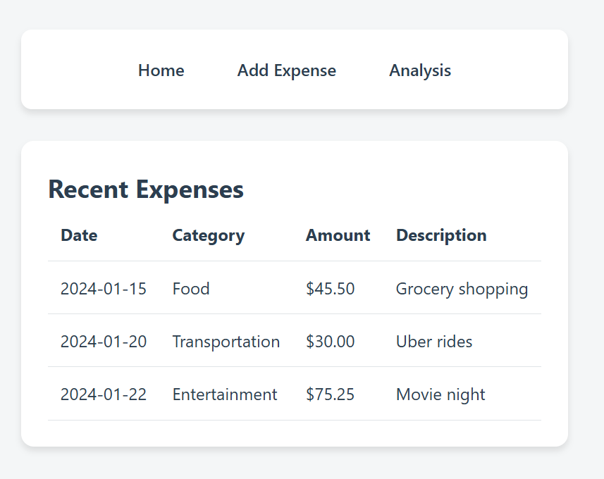
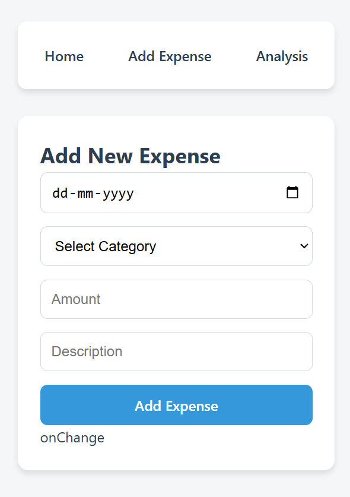

# Expense Tracker

A **simple and user-friendly expense tracker** built with React to help you manage and track your expenses effectively.

---

## 🚀 Features

- **Add, edit, and delete expenses**
- **Categorize expenses** (e.g., Food, Travel, Shopping, etc.)
- **View expense history** with timestamps
- **Search and filter expenses** by categories or keywords
- **Dynamic charts** to visualize spending patterns
- Responsive design for both desktop and mobile

---

## 🛠️ Technologies Used

- **React**: Frontend framework
- **Tailwind CSS**: For styling
- **Chart.js**: To create expense visualizations
- **Context API**: For state management
- **LocalStorage**: To persist data (optional: integrate a backend later)

---
## Images




## 📦 Installation

1. Clone the repository:
   ```bash
   git clone https://github.com/your-username/expense-tracker.git
   cd expense-tracker
